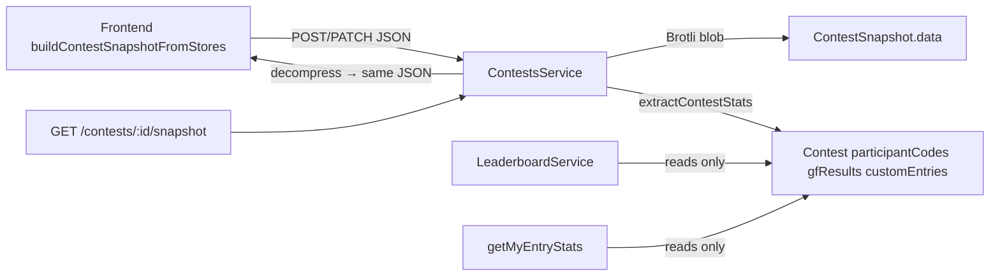

# Contest snapshot compression & stats denormalization

This document describes the **v2 contest snapshot storage format**, the **denormalized stats** copied onto `Contest` documents, and how to run or reason about the one-time migration. Use it when debugging snapshot load failures, extending snapshot fields, or tuning MongoDB storage.

For **what** leaderboard and entry-stats metrics mean (GF rank, clamping, etc.), see [contests-leaderboard-and-entry-stats.md](./contests-leaderboard-and-entry-stats.md).

---

## At a glance

| | **Before (v1)** | **After (v2)** |
|---|---|---|
| **Collection** | `contestsnapshots` | Same |
| **Heavy payload** | Plain BSON: `setup`, `simulation`, `customEntriesUsed` | Single Brotli blob in `data` |
| **Typical doc size** | ~33 KB average (dominated by `predefinedVotes`) | ~3–5 KB compressed blob |
| **Leaderboard / entry-stats reads** | Project subfields from snapshots (or full docs) | Read `participantCodes`, `gfResults`, `customEntries` on `contests` |
| **Frontend API** | Unchanged | Unchanged (`GET /contests/:id/snapshot` still returns expanded JSON) |
| **schemaVersion** | `1` | `2` |

**Observed prod migration (Jul 2026):** ~54k snapshots, ~910 MB logical JSON → ~153 MB blobs (~83% reduction on snapshot payload).

---

## 1. Why we did this

`contestsnapshots` stored the full serialized frontend state per contest. Most of each document was `simulation.results.predefinedVotes` (compact vote tuples, but expensive in BSON). With ~51k+ documents the collection reached ~1.66 GB logical data size on MongoDB Atlas, forcing a paid tier.

Goals:

1. **Cut MongoDB logical size** losslessly (no feature regression).
2. **Keep the frontend contract** — clients still send/receive the same snapshot JSON shape on create/update/load.
3. **Speed up leaderboard and entry-stats** by not scanning heavy snapshot documents on every aggregation.

---

## 2. Architecture



**Write path** (`create` / `update`):

1. Validate snapshot shape and size (unchanged, ~1 MB cap on uncompressed JSON).
2. Build payload `{ setup, simulation, customEntriesUsed }`.
3. Compress to `data` buffer, save snapshot with `schemaVersion: 2` (no plain `setup` / `simulation` on the document).
4. `extractContestMetadata()` → existing contest list fields (`stageNames`, `winner`, etc.).
5. `extractContestStats()` → new denormalized fields on `Contest`.

**Read path** (`getSnapshot`):

1. Load snapshot document.
2. If `data` is present, decompress and return `{ setup, simulation, customEntriesUsed, … }` (same shape as v1).
3. Else return legacy v1 document as-is (backward compatible during rollout).

---

## 3. Snapshot codec (v2)

**Module:** `douze-points-backend/src/contests/snapshot-codec.ts`

| Piece | Detail |
|-------|--------|
| Algorithm | Brotli (`zlib.brotliCompressSync` / `brotliDecompressSync`) |
| Quality | `6` (good ratio, fast enough at save time) |
| Wire format | `[codecByte=0x01][brotli(JSON)]` |
| Payload JSON | `{ setup, simulation?, customEntriesUsed }` only |

Helpers:

- `encodeSnapshotBlob(payload)` — write path.
- `decodeSnapshotBlob(buf)` — read path.
- `snapshotDataToBuffer(value)` — normalize MongoDB binary shapes (`Buffer`, `{ type: 'Buffer', data: [] }`, BSON `{ buffer }`, etc.).
- `snapshotDocToPayload(doc)` — v1 or v2 document → payload object.

Adding new snapshot fields in the future only requires the frontend serializer to include them; they flow through JSON → Brotli automatically. Bump `schemaVersion` / codec byte only if the encoding itself changes.

---

## 4. Denormalized stats on `Contest`

**Schema:** `douze-points-backend/src/contests/schemas/contest.schema.ts`  
**Extraction:** `douze-points-backend/src/contests/stats-extract.ts` → `extractContestStats(snapshot)`

| Field | Content |
|-------|---------|
| `participantCodes` | Union of all `setup.stages[].participants` (includes `custom-*` codes) |
| `gfResults` | GF stage rows from `simulation.countriesStateByStage` (key where `id.toUpperCase() === 'GF'`), each `{ code, points }` with `points = juryPoints + televotePoints`, sorted points desc then code asc |
| `customEntries` | Copy of `customEntriesUsed` (`code`, `name`, `flag`) |

These are **derived only** — safe to recompute from a snapshot if ever needed.

**Consumers:**

- `LeaderboardService` — `forEachCompletedContest()` merges into country aggregates without touching `contestsnapshots` when `participantCodes` is present.
- `ContestsService.getMyEntryStats()` — same; falls back to snapshot decompress only for unmigrated contests.

---

## 5. Leaderboard memory safety

Pre-migration fallback (decompressing snapshots for stats) must not load tens of thousands of documents at once.

`LeaderboardService.forEachCompletedContest()`:

- Walks completed contests in batches of **100** (`CONTEST_BATCH_SIZE`).
- Per batch: load only needed snapshots with projection  
  `data setup.stages.participants simulation.countriesStateByStage customEntriesUsed`  
  (avoids loading vote payloads on legacy v1 docs).
- Aggregates into in-memory maps, then discards the batch.

After migration, batches only read small fields from `contests` — fast and low memory.

---

## 6. MongoDB schemas

### `ContestSnapshot` (v2)

```text
contestId       ObjectId (indexed)
schemaVersion   number (2)
data            Buffer (Brotli blob)
setup           optional — v1 only, removed on migrate
simulation      optional — v1 only
customEntriesUsed optional — v1 only
timestamps
```

### `Contest` (additions)

```text
participantCodes  string[]
gfResults         { code, points }[]
customEntries     { code, name, flag }[]
```

Existing derived fields (`stageNames`, `winner`, `totalParticipants`, etc.) are unchanged.

---

## 7. Migration script

**Path:** `douze-points-backend/scripts/migrate-snapshots.ts`  
**Command:**

```bash
cd douze-points-backend

# Dry run (default) — reports counts and approximate size reduction
npm run migrate:snapshots

# Apply
npm run migrate:snapshots -- --apply
```

**Per snapshot document:**

1. Read v1 payload via `snapshotDocToPayload`.
2. Compress with `encodeSnapshotBlob`.
3. Round-trip verify (`decodeSnapshotBlob` deep-equal to original).
4. `$set` `{ schemaVersion: 2, data }`, `$unset` `setup`, `simulation`, `customEntriesUsed`.
5. `$set` denormalized stats on the linked `Contest` (`contestId`).

**Idempotent:** only processes docs where `schemaVersion < 2` or `data` is missing. Re-running after success prints `Snapshots to migrate: 0`.

**Batch size:** 100 snapshots per bulk write pass.

**Note:** Logical `dataSize` drops immediately after `$unset` of plain fields. On-disk space may need Atlas compact/resync; verify with `db.stats()` before changing Atlas tier.

---

## 8. Rollout checklist

1. Deploy backend that writes v2 + reads v1/v2 (`getSnapshot` decompress).
2. `npm run migrate:snapshots` (dry run) — confirm counts and ~80%+ reduction estimate.
3. `npm run migrate:snapshots -- --apply`
4. Verify:
   - Open/save/load a contest (including custom entries, multi-stage sim).
   - Country leaderboard (`GET /contests/me/leaderboard`).
   - Entry stats modal.
   - `db.stats()` / collection stats for `contestsnapshots`.
5. Optional later: remove snapshot-decompress fallback in leaderboard once all contests are guaranteed migrated.

---

## 9. Frontend impact

**None** for normal flows. The client still:

- Builds snapshots with `buildContestSnapshotFromStores()` (`src/helpers/contestSnapshot.ts`).
- Posts/patches opaque `snapshot` on create/update.
- Loads via `useContestSnapshotQuery` → `GET /contests/:id/snapshot`.

Types in `src/types/contestSnapshot.ts` still describe the **expanded** API response, not the stored blob.

---

## 10. Future options

| Option | When |
|--------|------|
| **R2 offload** | Move `data` blobs to Cloudflare R2; keep only stats + pointer in Mongo. Cheapest at very large scale. |
| **Positional vote encoding** | Further shrink blobs by encoding votes as ordered country-code arrays instead of `[code, pointsId]` tuples. More code churn; Brotli already captures most repetition. |
| **TTL / archival** | Only if product accepts losing old contest state (not current policy). |

---

## 11. Key file map

| Area | Location |
|------|----------|
| Codec encode/decode | `douze-points-backend/src/contests/snapshot-codec.ts` |
| Stats extraction | `douze-points-backend/src/contests/stats-extract.ts` |
| Snapshot schema | `douze-points-backend/src/contests/schemas/contest-snapshot.schema.ts` |
| Contest schema (denormalized fields) | `douze-points-backend/src/contests/schemas/contest.schema.ts` |
| Create/update/getSnapshot | `douze-points-backend/src/contests/contests.service.ts` |
| Leaderboard batch aggregation | `douze-points-backend/src/contests/leaderboard.service.ts` |
| Migration script | `douze-points-backend/scripts/migrate-snapshots.ts` |
| Codec/stats unit tests | `douze-points-backend/src/contests/snapshot-codec.spec.ts`, `stats-extract.spec.ts` |
| Frontend snapshot build/load | `eurovision-scoreboard/src/helpers/contestSnapshot.ts` |
