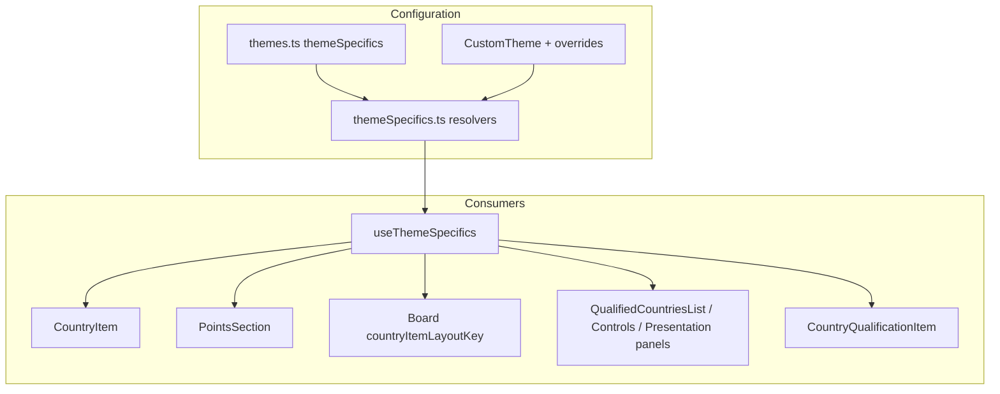

# Rounded country layout & 2026 theme

This document describes the **rounded pill country row** introduced for the **2026** built-in theme and how to extend or clone it for future years (e.g. 2027). It complements [theme-animations-and-specifics.md](./theme-animations-and-specifics.md) (board/Douze Points animation flags) and [running-order-and-tiebreaking.md](./running-order-and-tiebreaking.md).

**Primary flag:** `roundedCountryContainer` in `ThemeSpecifics` (`src/theme/types.ts`).

When `roundedCountryContainer === true`, the scoreboard country row, points blocks, side panels, and qualification UIs switch to a shared “pill” layout. Legacy themes keep the classic rectangle + optional triangle points.

---

## 1. Enabling the layout (2026 example)

### Built-in theme entry

In `src/theme/themes.ts`, under the year key (e.g. `'2026'`):

```ts
themeSpecifics: {
  pointsContainerShape: 'square',      // not 'triangle' — see §3
  roundedCountryContainer: true,
  isJuryPointsPanelRounded: true,       // controls / presentation panels
  fontAlias: 'gotham',                  // optional; falls back to DEFAULT_THEME_SPECIFICS font
},
```

2026 also sets `flagShape: 'square'` at the theme root (outside `themeSpecifics`) and uses a gold palette in `colors.countryItem` plus `televoteOutline: 'hsl(0, 0%, 100%)'` for the active televote glow.

### Resolution at runtime

All UI code should read specifics via `useThemeSpecifics()` → `resolveThemeSpecificsForGeneralState()` (`src/theme/themeSpecifics.ts`).

Merge order:

1. `DEFAULT_THEME_SPECIFICS`
2. Base theme `theme.themeSpecifics` from `themes.ts`
3. Legacy top-level fields on `CustomTheme` (API compatibility)
4. `customTheme.themeSpecifics` overrides

**Do not** branch on `themeYear === '2026'` in components; branch on `roundedCountryContainer` (and other specifics) only.

### Custom themes

- **Create / edit:** `CustomizeThemeModal.tsx` calls `applyThemeSpecificsFormState(resolveThemeSpecificsForBaseThemeYear(year))` when opening “new theme” and when the **base theme** dropdown changes, so visual-detail fields match that year’s `themeSpecifics`.
- **Payload:** Non-default specifics are stored as `null` or explicit overrides on the theme document (same pattern as other `themeSpecifics` fields). See §8.

---

## 2. Architecture overview



| Concern | Rounded ON | Rounded OFF (legacy) |
|--------|------------|----------------------|
| Row shape | Full-height pill (`rounded-full`) | `rounded-[1px]`, `shadow-md`, optional `outline` when active |
| Points position | Inline flex: name strip + fixed-width points track on the right | Absolute-positioned points / last points |
| `pointsContainerShape === 'triangle'` | **Ignored** in rounded branch (no `RoundedTriangle`) | Triangles shown when shape is `triangle` |
| Hover feedback | `drop-shadow` glow on pill (`filter`) | `brighten-on-hover` (`brightness` filter) |
| Active televote | Multi-layer `drop-shadow` using `televoteOutline` color | CSS `outline` on container |
| Side panels | `.qualified-countries-panel--rounded` + theme hue glow | `rounded-md` + `shadow-md` |

---

## 3. Points section (`PointsSection.tsx`)

### Entry condition

```ts
if (roundedCountryLayout) { /* rounded branch */ }
```

`roundedCountryLayout` is passed from `CountryItem` as `roundedCountryContainer` from `useThemeSpecifics()`.

### Triangle shape is ignored

`withTriangle = pointsContainerShape === 'triangle'` applies only to the **legacy** branch at the bottom of the file. The rounded branch **never** renders `RoundedTriangle`, even if the theme sets `pointsContainerShape: 'triangle'`. For rounded themes, use `'square'` (2026 default).

### Layout model (non-triangle pill)

- **Row:** `flex` track pushed right (`ml-auto`), negative margin overlaps the name strip (`-ml-2` … `lg:-ml-4`).
- **Current points block:** `rounded-full rounded-l-none`, inset shadow, optional outer shadow when last points are active.
- **Last points block:** Reserved width on the right; transparent when inactive (`lastReceivedPointsActive` / `showLastPoints`). GSAP enter/exit animates this column (`useAnimatePoints` with `lastPointsAnimationDirection: 'left-to-right'` from `CountryItem`).
- **Track width:** Fixed `calc(...)` so the flag/name strip does not jump when last points appear. Values are tuned per breakpoint (see below).

### Responsive sizing

**Rule:** `lg:` (1024px+) values are the design baseline. Below `lg`, the same proportions are kept but slightly smaller. Do not copy pre-2026 mobile absolute-layout widths into the rounded branch.

| Breakpoint | When | Notes |
|------------|------|--------|
| Default | &lt; `md` | Compact widths/text |
| `md:` | ≥ 768px | Intermediate track/current sizes |
| `lg:` | ≥ 1024px | **Reference layout** (matches approved 2026 desktop UI) |
| Two-column compact | `useScoreboardTwoColumnCompactLayout(isTwoColumnLayout)` | Narrow board (`max-width: 479px`) + two-column setting; further reduced track widths in `PointsSection` |

Implementation lives entirely inside the `if (roundedCountryLayout)` block in `PointsSection.tsx` (search for `roundedCurrentPointsBlockClass`, `roundedPointsTrackWidthClass`).

### GSAP / theme switches

`pointsLayoutKey` (from `Board.tsx`: `themeYear:customThemeId:roundedCountryContainer:pointsContainerShape`) triggers `useLayoutEffect` in `PointsSection` to `killTweensOf` and `clearProps: 'all'` on rounded refs and last-points refs, and sync points text. **Required** when toggling theme or layout so points do not stay at `opacity: 0` with stale transforms.

`useAnimatePoints` must receive the same `pointsLayoutKey` and `lastPointsAnimationDirection: 'left-to-right'` when rounded.

---

## 4. Country row (`CountryItem.tsx` + `CountryItemBase.tsx`)

### Split surfaces (rounded)

Outer button: `!rounded-full !bg-transparent` + **filter** for glow (not background on the full width).

Background gradient/colors from `buttonClassName` apply to the **name strip** only:

- `splitRoundedCountryItemSurfaceClasses()` in `roundedCountryItemGlow.ts` splits `bg-*` → content strip, `opacity-*` → container.
- `contentStyle` / `contentClassName`: `rounded-r-full`, shadow, `bg-*` classes.

### Glow (`roundedCountryItemGlow.ts`)

| State | Implementation |
|-------|----------------|
| Inactive / jury clickable | `ROUNDED_SUBTLE_GLOW` / `ROUNDED_SUBTLE_GLOW_HOVER` on `filter` |
| Active televote | `buildActiveTelevoteDropShadowFilter(televoteOutlineColor)` |

**Color source:** `resolveTelevoteOutlineColor(themeYear, overrides)` → `countryItem.televoteOutline` from theme or custom overrides. The glow uses the **outline color as configured** (e.g. white for 2026).

**Critical implementation detail:** `hsl(h, s%, l%)` with **commas** must not be passed inside `drop-shadow(...)` — commas break the filter parser and flash **black**. Colors are converted to `rgb(r g b / alpha)` in `toFilterSafeColor()` before building filters.

**Do not** use `var(--countryItem-televoteOutline)` inside `drop-shadow`; use resolved color strings in JS (see comment history in `CountryItem`).

### Hover / click (`useItemState.ts`)

When `roundedCountryContainer`:

- Jury / reveal televote: `cursor-pointer` only (no `brighten-on-hover`).
- Active televote: no `outline` class on the container (glow replaces it).

### `CountryItemBase` inline layout

`useInlineContentLayout={true}` makes flag/name and points siblings in a flex row so the points track reserves width. Legacy layout uses absolute positioning for points.

---

## 5. Board integration (`Board.tsx`)

```ts
const countryItemLayoutKey = `${themeYear}:${customThemeId}:${roundedCountryContainer}:${pointsContainerShape}`;
```

Passed to `CountryItem` → `useAnimatePoints` + `PointsSection`. Any change to rounded layout or theme must bump this key (already automatic when store theme changes).

`className` on board list: `gap-y-[1px]` when rounded (tighter vertical rhythm).

---

## 6. Side panels (qualification / controls / presentation)

### CSS class

`src/styles.css` — `.qualified-countries-panel--rounded`:

- Large radius (`1.6rem`)
- Outer glow via `hsl(var(--qualified-panel-glow-hue) …)` (two layers)
- Inset black shadow (top/left depth)

### Theme-derived hue

`src/theme/qualifiedCountriesPanelGlow.ts`:

- Hue from `customTheme.hue` or parsed from `primary.800` of base theme
- `getPanelGlowHue(baseHue)`: warm hues (+170°), cool hues (+60°)
- Exposed as CSS variable `--qualified-panel-glow-hue` via `useQualifiedCountriesPanelGlowStyle(enabled)`

**Consumers** (when `roundedCountryContainer`):

- `QualifiedCountriesList.tsx`
- `ControlsPanel.tsx`
- `PresentationPanel.tsx`

Non-rounded themes keep `rounded-md shadow-md` without the glow class.

---

## 7. Qualification UIs

### `CountryQualificationItem.tsx`

Mirrors rounded scoreboard styling at a smaller scope:

- Subtle glow via `getRoundedSubtleGlowStyle` (hover when clickable)
- Text colors: `roundedTextClasses` on container; `bg-*` on inner strip only (modal sets `text-white` on ancestors — do not rely on inheritance alone)
- No points section; single pill for flag + name

### `QualificationResultsModal.tsx`

Same item component; grid layout. Modal root uses `text-white`; rounded text tokens must be on the item container.

---

## 8. Theme editor & API (`CustomizeThemeModal.tsx`)

When creating a theme or changing **base theme year**:

```ts
applyThemeSpecificsFormState(resolveThemeSpecificsForBaseThemeYear(year));
```

Sets: `pointsContainerShape`, `roundedCountryContainer`, `isJuryPointsPanelRounded`, `flagShape`, animation modes, `fontAlias`, etc.

Live preview `CustomTheme` object must include the same fields so the modal preview matches saved themes.

Saving compares each field to `resolveThemeSpecificsForBaseThemeYear(baseThemeYear)` and stores only differences as overrides (`null` = revert to base default on update).

---

## 9. Related theme fields (2026)

| Field | 2026 value | Rounded layout interaction |
|-------|------------|---------------------------|
| `pointsContainerShape` | `'square'` | Triangles disabled in rounded `PointsSection` |
| `roundedCountryContainer` | `true` | Master switch for this doc |
| `isJuryPointsPanelRounded` | `true` | Panel border radius only; independent of country pill |
| `fontAlias` | `'gotham'` | UI font via `fontAliases.ts` / `data-font` on `<html>` |
| `flagShape` | `'square'` (theme root) | Flag sizing in `useFlagClassName` when rounded |
| `boardAnimationMode` | (default teleport) | Unchanged by rounded layout; winner still forces flip on finished simulation |
| `countryItem.televoteOutline` | White (2026) | Active televote glow color |

---

## 10. Checklist: adding or cloning a year (e.g. 2027)

### A. New built-in year in `themes.ts`

1. Copy structure from a recent year; set `colors`, `backgroundImage`, root `flagShape` if needed.
2. Add `themeSpecifics` with at least:
   - `roundedCountryContainer: true` if you want the pill UI
   - `pointsContainerShape: 'square'` (recommended for rounded)
   - `isJuryPointsPanelRounded: true` if panels should match 2026
   - `fontAlias` if not Montserrat
3. Tune `countryItem.*` tokens (especially `televoteOutline` for glow, jury/televote backgrounds).
4. Register year in theme lists (`YEARS_WITH_THEME`, etc.) so Tailwind `tw-colors` generates CSS variables.

### B. Visual QA matrix

Test at **1024px+** first (lg baseline), then resize down:

- [ ] Scoreboard: jury voting, televote active, reveal televote, finished, unqualified
- [ ] Last points appear/disappear (GSAP) without stuck opacity/transform
- [ ] Theme switch (2026 ↔ legacy) clears GSAP (`pointsLayoutKey`)
- [ ] Hover glow on jury/reveal rows; active televote glow color matches `televoteOutline`
- [ ] Two-column mobile board (`≤479px` + two-column layout) if supported
- [ ] Qualification list + results modal text contrast
- [ ] Controls + presentation + qualified panels glow hue vs background

### C. Custom theme from 2027 base

1. Open customize modal with app on 2027 → fields should prefill from `themeSpecifics`.
2. Change only overrides needed; save.
3. Confirm preview uses `roundedCountryContainer` and points layout from form state.

### D. Files you will touch most often

| Change | Likely files |
|--------|----------------|
| Colors / outline / glow color | `themes.ts`, overrides in DB |
| Pill widths / breakpoints | `PointsSection.tsx` (rounded block only) |
| Glow strength / color parsing | `roundedCountryItemGlow.ts` |
| Panel frame/glow | `styles.css`, `qualifiedCountriesPanelGlow.ts` |
| New specificity flag | `types.ts`, `themeSpecifics.ts`, `useThemeSpecifics.ts`, `CustomizeThemeModal.tsx`, consumers |
| Qualification styling | `CountryQualificationItem.tsx` |

### E. Do not break legacy themes

Any change in shared components must stay behind `if (roundedCountryLayout)` / `if (roundedCountryContainer)` branches. Legacy path at the bottom of `PointsSection.tsx` and non-rounded classes in `useItemState.ts` should remain unchanged unless intentionally redesigning all years.

---

## 11. Troubleshooting

| Symptom | Likely cause | Where to look |
|---------|----------------|---------------|
| Black flash on active televote | `filter` transition between unlike filters, or comma-`hsl` in `drop-shadow` | `CountryItem` glow; use `toFilterSafeColor` / rgb syntax |
| Points invisible after theme change | Stale GSAP `opacity`/`transform` | `pointsLayoutKey` + `useLayoutEffect` clear in `PointsSection` |
| Glow color ignores white outline | Old fallback replacing light outlines with `televoteActivePointsBg` | Removed — use `televoteOutline` directly |
| Mobile points layout “wrong” | Using legacy absolute widths | Rounded branch only; scale from `lg:` baseline |
| Modal qualification white-on-white text | `text-white` on modal without `text-*` on item | `CountryQualificationItem` `roundedTextClasses` |
| Panel glow wrong hue | `primary.800` hue vs custom theme `hue` | `qualifiedCountriesPanelGlow.ts`, hook on panel |

---

## 12. Key file index

```
src/theme/types.ts                          # ThemeSpecifics.roundedCountryContainer
src/theme/themes.ts                         # Per-year themeSpecifics (2026 block)
src/theme/themeSpecifics.ts                 # Resolvers + CustomizeThemeModal defaults
src/theme/qualifiedCountriesPanelGlow.ts    # Panel glow hue CSS variable
src/theme/useQualifiedCountriesPanelGlowStyle.ts

src/components/countryItem/CountryItem.tsx
src/components/countryItem/CountryItemBase.tsx
src/components/countryItem/PointsSection.tsx
src/components/countryItem/hooks/useItemState.ts
src/components/countryItem/utils/roundedCountryItemGlow.ts
src/components/countryItem/utils/gradientUtils.ts
src/hooks/useAnimatePoints.ts
src/hooks/useScoreboardTwoColumnCompactLayout.ts

src/components/board/Board.tsx
src/components/controlsPanel/ControlsPanel.tsx
src/components/presentationPanel/PresentationPanel.tsx
src/components/simulation/qualification/QualifiedCountriesList.tsx
src/components/simulation/qualification/CountryQualificationItem.tsx
src/components/setup/widgets-section/custom-themes/CustomizeThemeModal.tsx

src/styles.css                               # .qualified-countries-panel--rounded
```

---

*Last updated for the 2026 rounded country layout workstream. When adding 2027, extend §1 and §10 and keep §3–§4 in sync with any layout tweaks.*
